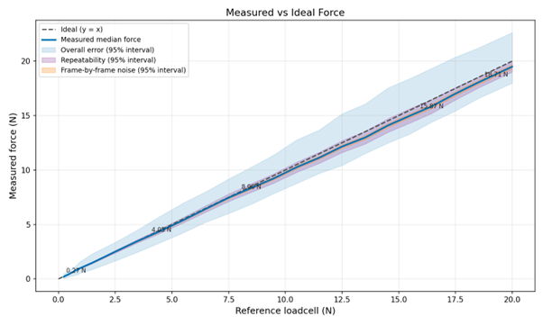
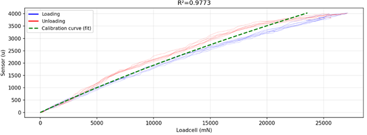
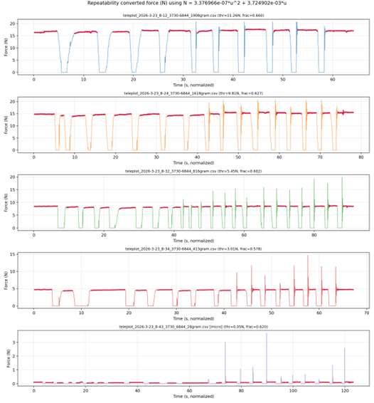

# Forces

## Active force control
The thumb, index, middle and ring finger feature Active Force Feedback (AFFB). The AFFB module can provide resistance on the operator’s fingers, simulating a rigid object in the robot’s grasp – as well as actively pulling force on the fingers, simulating for example an elastic object compressed by the robot hand. The active force feedback can simulate the resistance of a firm grip.


| **Limits**                                                                                                 | **Weight equivalents** | **Force (N)** | **Context**                                                                                                                                                                                                     |
| ---------------------------------------------------------------------------------------------------------- | ---------------------- | ------------- | --------------------------------------------------------------------------------------------------------------------------------------------------------------------------------------------------------------- |
| **Min force  (default wire tension)**                                                                      | ~20 gram force         | 0.2 N         | Force goal set in firmware to keep tension                                                                                                                                                                      |
| **Max force resisting the finger<br>**(higher should not break the glove, but it pulls through the motor.) | ~2.5 kg force          | 25 N          | Pulling on the wire with max motor force enabled, with a PCE-DFG N 200 Force gauge.                                                                                                                             |
| **Max force actively pulling finger (until stall):**                                                       | ~350 gram force        | 3.5 N         | R1 force module ramping motor (0 to 100 PWM over 30 seconds) pulling on a stationary calibrated 5kg loadcell.                                                                                                   |
| **Software minimum force goal recommendation:**                                                            | 20 gram force          | 200 mN        | If set lower, it is clamped internally                                                                                                                                                                          |
| **Software maximum force goal recommendation:**                                                            | 2.0 kg force           | 20000 mN      | Scale this to achieve the desired feedback (so its stiff for stiff objects, squishy for squishy objects, while it’s stable). Please see the documentation for tips. Setting it higher will not break the glove. |


Notes:

-	With prolonged high forces (full force 15 minutes), internal temperature sensors may activate overheat protection, disabling force feedback for a finger temporarily to cool down.
-	The forces listed are tension forces in the wire pulling the finger back, not the force on fingertips. For fingertip forces in a stretched hand, the force on the fingertips is approximately 1/2 the wire tension force, depending on hand size. For bent fingers, it becomes less. This conversion will be available in software later this year.
-	Due to control settings to ensure stability, and hysteresis in sensing, deviations may occur between the set goal and final force on the wire.
To counter these limitations, we encourage scaling up the force goals experimentally until the desired sensation is achieved.

## Implementing force control
In the `main_example.py`, this how to set a force:
```python
            """
            Forces: switch on or off by commenting/uncommenting
            """
            forces = [1000, 1000, 1000, 1000]   # means you set all fingers to 1000mN
            SG_main.set_force_goals(hand_id, forces)
```

[set_force_goals()](api-reference.md#SG_API.SG_main.set_force_goals) accepts a list with one force goal per finger (in milliNewtons) and is sent to the glove, which will from then on be the new force goal in a control loop on the glove itself rotating the motor. The force is measured where the wire is retracted by the motor as the tension on the wire. When the force is set to 0, it keeps a minimal tension of ~80 grams (=800 mN) on the wire to prevent it from getting slack, allowing the finger to move as free as possible.

The forces will be sent, together with any vibrations, at the end of the new_data_callback. This means the latest forces set at that moment will then be transferred to the glove.


Notes: 

- The final force on the wire might differ from the force goal requested to allow stable control. Scale up the forces if necessary.
- The milliNewtons are the tension in the wire pulling the finger back.
- The pinky does not have a force feedback motor, so is not controllable.


## Force sensor
Each AFFB module (thumb to ringfinger) is equipped with a force sensor, allowing for robot operation and imitation learning leveraging not only precise finger motion data, but also grasp force data. It is measured in the force module, where the wire is retracted in the hub of the hand. For optimal results, combine R1 gloves with robot hands featuring force sensing – either through current measurements or dedicated force sensors.

| **Limits**                                            | **Weight equivalents** | **Forces (in N, or % of applied load)**                                         |
| ----------------------------------------------------- | ---------------------- | ------------------------------------------------------------------------------- |
| **Max force measurable:**                             | ~2 kg                  | 20 N                                                                            |
| **Mean absolute error**                               | 91 grams               | 0.9 N                                                                           |
| **Max error (95% CI)**                                | 265 grams              | 2.6 N                                                                           |
| **Repeatability**                                     |                        | 4.4%      (typical: median) +-13.3% (max error 95% interval) |
| **Frame-by-frame noise**                              |                        | 1.38%     (typical: median)+-4.1% (max error: 95% interval)                   |
| **Resolution sensor<br>**(smallest detectible change) | ~ 1 gram               | 0.01 N                                                                          |



This average and max error is mostly due to hysteresis. This means that error is only noticeable as difference between increasing pressure and releasing pressure. When increasing pressure with the same force repeatedly, this is usually repeatable within 4.4%, and frame-by-frame noise is normally <2% of applied load.


# Appendix: Measurement conditions
20 R1 force feedback modules without exoskeleton were mounted on a loadcell one by one. The wire was pulled manually, multiple times with a smooth motion, and multiple times with irregular jittery motion, until a force over 20N was obtained before releasing it with similar motion back to 0.

Example calibration for a single force module.


This shows an example calibration of a module as used internally. Hysteresis is present, shown with the blue and red lines. Sensor values between 50 and 4000 are used to fit the curve. The measured raw sensor values are mapped to newtons using the resulting green curve. The resulting values are used in control and that can be read from the software.
For calculating errors, we measured in the range of values that would be used: no raw sensor data limits, but any data above 20N was discarded.


## Calculating the overall error
The measured sensor values, converted to Newtons with green line, were compared to the loadcells ground truth values. The absolute averages of these errors, and 95% confidence intervals (CI) were calculated over data from all modules. From this the main plot was plotted.

## Repeatability and frame-by-frame variation
These were measured from one force feedback module, hanging 5 different weights (28g, 413g, 816g, 1618g, 1908g) on the wire. These were hanged manually: a few times gently, and a few times suddenly dropped, see the raw measurements below. The stable areas were isolated automatically by looking at percentages around the desired weight and skipping the first 200ms of the weight being reached. To calculate repeatability, the mean values between different hangs were compared to calculate the 95% CI. To calculate the frame-by-frame variation, the |previous - current| force was measured for all frames within a hang. 95% range was then taken over those values from all hangs.



To display these the main figure these CI’s were then plotted around the median value.