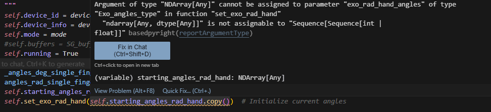

# Getting Started
## Supported OS:
- Windows
- Linux Ubuntu >= 20.04, and other Linux systems with >= GCC 9 

## Supported python versions (currently)

- python 3.8
- python 3.12

We recommend anaconda to install these to manage multiple versions (now or in the future) easily.

If you require a different version >3.8, we can support it by recompiling the library. Send us a message if required.

## Installation
### Required Software/drivers:

#### Windows
For Windows, install the WinUSB driver: [Zadig](https://zadig.akeo.ie/). Linux does not require a driver.
   * Opening this, with the glove plugged in, Select R1 (Composite Parent) in the dropdown. Don't change any other settings. Click Install Driver.

#### Linux
To allow non-root access to the Rembrandt device over USB, you need to add a custom udev rule.
1. Create a new rule file:
  
        sudo nano /etc/udev/rules.d/99-rembrandt.rules

2. Paste the following:

        SUBSYSTEM=="usb", ATTR{idVendor}=="2e8a", ATTR{idProduct}=="10f3", MODE="0666"

3. Reload & Apply:

        sudo udevadm control --reload-rules && sudo udevadm trigger


## Setup
See [Troubleshooting](#troubleshooting) for common errors and issues.
* Install **python 3.8.x** or **python 3.12**. Use [Python](https://www.python.org/downloads/) or [Anaconda](https://www.anaconda.com/download/success) (virtual env manager for python, allowing multiple python versions on one pc). 
*  **Clone the Repository**
   ```bash
   git clone https://gitlab.com/senseglove/rembrandt-api/
   ```
   You can clone this to a subfolder of your project, or run examples directly from the provided API.
* **Install python packages**
* Set your python interpreter to your python environment (VScode: Ctrl+Shift+P > Python interpreter). 
1. In terminal, navigate to the parent directory of `SG_API` (where the setup.py file is).
    ```bash
    cd Rembrandt-API
    ```


    
2. Run pip install. Make sure it uses the python version from your anaconda environment.

    Example for Windows anaconda (replace your environment). 
    ```
    %USERPROFILE%/anaconda3/envs/yourEnvironment/python.exe -m pip install -e .
    ```

    If normal python (no anaconda):
    ```bash
        pip install -e .
    ```

    Similar for Linux, `conda activate yourenv` before running `pip install -e .`, or alternatively use the python path of your environment with the `your/path/to/python -m pip install -e .`


### Examples / Quick start
PLEASE READ THIS SECTION ENTIRELY BEFORE STARTING

This section walks you through the most important features of the script `main_example.py` which is a script using the main features of the API, as you would in your project. You can find this and more in the `examples` folder. 

#### Switch between Simulated and Real glove
You can develop even without a physical glove. For that, use the following init:
```python
from SG_API import SG_main, SG_types as SG_T 

device_ids = SG_main.init(1, SG_T.Com_type.SIMULATED_GLOVE)
```
This will start a steady simulated glove, which you can set to continually open/close, or set to steady (see main_example.py). 
For in depth simulated glove functions see [Simulated Glove](simulated_glove.md)

For using an actual glove, change SIMULATED_GLOVE to REAL_GLOVE_USB :
```python
device_ids = SG_main.init(1, SG_T.Com_type.REAL_GLOVE_USB)
```
#### On new data callback
The on_new_data callback fires when the glove has updated the data in the API, such as tracking or force data. `SG_main` contains all functions you need. Some commonly needed functions are given here.

```python
    def on_new_data(from_device_id):
        if from_device_id == hand_id:
            exo_poss, exo_rots = SG_main.get_exo_joints_poss_rots(hand_id)
            gui.update_hand_exo(exo_poss)

            fingertips_poss, fingertips_rots = SG_main.get_fingertips_pos_rot(hand_id)

            flexion_perc_bents, abduction_perc_bents = SG_main.get_percentage_bents(hand_id)

            forces = simulate_forces()
            SG_main.set_force_goals(hand_id, forces)

    SG_main.add_rembrandt_data_callback(on_new_data)


```

> ⚠️ **Important Note**
>
> Keep what is in the new_data callback as brief as possible (preferably just copying the data). Heavy calculations will drop the 1kHz framerate required for crisp haptic feedback. For more info see [Performance](fps-performance.md).
 
#### Keep the script running
The data callback will automatically update with new data at 1khz, but only if the file is still running.
To do this, call:
```python
    SG_main.keep_program_running()
    # after this will not execute. It blocks until stopping the program. 
    # Ctrl+C or a command closing python stops it.
```

Alternatively, you can replace SG_main.keep_program_running() with this to run your own while loop with:
```python
    try:
        while SG_main.SG_cb.running:
            time.sleep(1)  # This loop does not do anything but keep the program alive. Some sleep is important to not eat all CPU capacity.
    except: 
        pass # important errors will still log. This try/except just ignores the keyboard interrupt error on Ctrl+C.
```

You can call functions such as `SG_main.get_fingertips_pos_rot(hand_id)` or `SG_main.set_force_goals()` in your own while loop instead of the `on_new_data` callback. This will retrieve the latest tracking data available, and when the callback loop ends internally, send the latest data in force goals to the glove. The callback `on_new_data` is purely a method to only update when new glove data is available.

> ⚠️ **Important Note**
>
> You must use sleep in the while loop, or your loop can eat up all CPU space which the callback needs to give data at 1kHz, important for good force feedback! For more info, see: [Performance](fps-performance.md).
 


#### Hover to get Docs in code
`SG_main` will contain most of what you need.
Don't forget that you can always hover on a function to see how to use it (in Vscode at least), or check the [API Docs](index.md).
 


# Examples

## main_example.py
Running `examples/main_example.py` should give you a screen like this, showing the top view of the exoskeleton of the glove in real time (or simulated glove). The blue dots are the fingertip positions, and the linkages of the exoskeleton are white. The axes are drawn at the origin of the glove.

Press the right mouse button and drag to rotate.

 

Additionally, forces can be turned on that apply to all fingers in gradual sine waves, minimal force, to maximal force, and back to minimal repeatedly.

## record_glove.py and play_recording.py
Aside from simulation, you play back captured motions as if the glove were connected, and also record your own. Currently this only records and plays back the tracking, and not forces.

You can record from any script using the following:
```python
    print("Recording glove data for 10 seconds...")
    SG_recorder.record_glove_data(hand_id, 10.0, "myrecording.json")
```
You can find this file in the `recordings/` folder. Recording again will overwrite it.
You can play that recording back with:
```python
    print("Playing back recording...")
    SG_recorder.play_recording(hand_id, "myrecording.json")
```
This will simulate the glove with these motions, so actually output all data you would expect via the API. There are existing recordings to work with in the recordings folder.


#### Tracking and Control

The types of tracking data are explained in [Tracking](tracking.md). Force feedback is explained in [Control](control.md).


### Convenience tip:
In .vscode / launch.json you can set "program": "${workspaceFolder}/your_file.py", and press F5 to play that script no matter the file you have open.


# Troubleshooting
## Libusb initialization error
```
Error: 2025-03-25 13:49:40.316 (   1.394s) [DataRetrievalLoo]    RembrandtDevice.cpp:1016  INFO| Initializing libusb device handle... - { VID: dead, PID: 1606, BN: 2, PN: 2, DA: 14 }
2025-03-25 13:49:40.316 (   1.394s) [DataRetrievalLoo]    RembrandtDevice.cpp:1024   ERR| Failed to initialize libusb device handle: Entity not found - { VID: dead, PID: 1606, BN: 2, PN: 2, DA: 14 }
```
This happens on Windows when you did not install the driver! See Required Software/Drivers above.

## FileNotFoundError .so or .dll:
```
FileNotFoundError: Could not find module 'C:\Users\<username>\anaconda3\envs\<yourenv>\lib\site-packages\SG_API\CPPlibs\libSG_math.dll' or `libSG_math.so` (or one of its dependencies). Try using the full path with constructor syntax.
```

This means that `pip install .` did not work correctly. Please try that again and make sure you use the correct python to call it. When in doubt, pip install using the python.exe similar to `C:/Users/yourUserName/anaconda3/envs/yourEnvironmentName/python.exe -m pip install -e .` (In some cases it may be pip3.) Then double check your interpreter in vscode to use the correct one (Ctrl+Shift+P -> Python interpreter). 

## Type errors
You might get yellow bars with errors similar to:



If your arrays have the correct shape, it should work when you actually run it. The warning is there because while numpy arrays can be used interchangeably with python arrays, the typing intellisense does not see they are compatible. You can ignore warnings like these as long as your array shape is correct.

Sequence[Sequence[int | float]] means it expects either a nested list or numpy array of shape: List[List[int or float]]. You can check SG_types (in the API_reference, or in the actual file) to check what is expected inside.

## running scripts is disabled on this system
```
anaconda3\shell\condabin\conda-hook.ps1 cannot be loaded because running scripts is disabled on this system.
```
This occurs sometimes on windows. To fix:
Open Powershell with admin rights (right click) and run:
`Set-ExecutionPolicy Unrestricted`

## Is my glove connected?
### Windows
Expected behavior in Windows Device Manager > Universal Serial Bus Devices: 
Once you plug in the device, you should see 2x Rembrandt showing up per glove (2 channels per glove).


If this is the case, the code should be able to connect. Make sure on Windows (not required for Linux), you also installed the driver with Zadig (see [Required Software/drivers](#required-softwaredrivers)).

