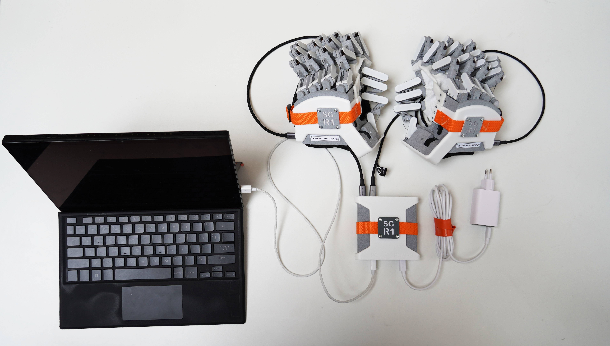
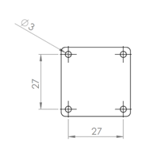

# Getting Started

Note: **You **can** also work on tracking **without** physical gloves**. For that use Simulation Mode (see the docs).

If you are working with one or two physical gloves, this is how to connect them with the linkbox. Note it doesn't matter what glove is in what port. Always use the specified charger.

## Supported OS:
- Windows
- Linux Ubuntu >= 20.04, and other Linux systems with >= GCC 9 

## Getting started in supported software:
- [Getting started: Python](./python_getting_started.md). This is the main API, supported and fully documented. Start reading here.
- [ROS2 is supported](https://github.com/Adjuvo/senseglove_r1_ros). Please let us know if your project requires ROS1. Our current python API can support ROS1, requiring **python 3.8.x**.
- Unity is not supported, although we might support this in the future. Please contact sales to discuss projects needing this support.

## Mount:
To mount the glove to a tracker or other device, you can unscrew the R1 logo, then use the holes with the following dimensions on the back of the glove.

 
Note: Mounting the glove directly to a haptic arm can be dangerous, as the arm may generate unintended high forces or speeds while the user is strapped into the glove. Mounting the glove to a haptic arm is done at the user’s own risk.
