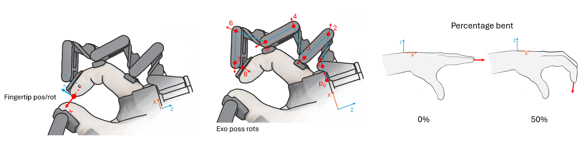

# Thank You for Being an Early Adopter!
Congratulations on being among the first to work with the R1 prototype! We sincerely appreciate your support and initiative in exploring the R1 at this stage. Any suggestions you have are invaluable in refining the system.

# What can the R1 do?

## Robot hand mapping
Quick implementable mapping to:

- Robot hands with 1DOF (degree of freedom) per finger, and 2DOF thumb: supported, needing some configuration to make pinches match. See [Robot hand mapper](./robot_hand_mapper.md) for more information.
- Robot hands with more DOF's per finger: Supported via custom integration projects. Contact us for more info.

## Glove tracking data
40 (5 fingers x 8 sensors) rotary hall effect sensors enable robust tracking of all five fingers, providing millimeter level precision at the fingertips and along each phalanx. Data can be retrieved from software in the following formats: fingertip position/rotations, exoskeleton rotations/positions, and percentage bents.

     

| **Tracking specs**                        | **Error**    |
| ----------------------------------------- | ------------ |
| **Average absolute deviation per joint:** | 0,42 degrees |
| **Max deviation measured in a joint:**    | 3,0 degrees  |
| **Exo fingertip open finger:**            | up to 3 mm   |
| **Exo fingertip near closed hand**        | up to 7 mm   |

Notes:

-	When using our robot hand mapper algorithm, this compensates for the tracking error resulting in pinch perfect accuracy.
-	Above values are for aligned exoskeleton linkages in a jig. The exoskeleton can bend sideways which allows for ergonomics of, for example, the ring finger and pinky. This can cause additional deviations in position. 
-	These values are for a 0.4 prototype. Tolerances improved for 0.5 (version since January 2026), which may result in more accurate tracking.

For further tracking possibilities, measurement conditions and tracking definitions [see the tracking docs](./tracking.md).

## Force feedback
The thumb, index, middle and ring finger (excluding pinky) feature Active Force Feedback (AFFB). The AFFB module can provide resistance on the operator’s fingers, simulating the presence of a rigid object in the robot’s grasp – as well as actively pulling force on the fingers, simulating for example an elastic object compressed by the robot hand. The active force feedback can simulate the resistance of a firm grip.

[See the force docs ](./forces.md)for more information.

# FPS and latency
| FPS (frames per second) | Up to 1kHz\* for single glove, 0.5kHz for two gloves.   \*depending on CPU specifications |
| ------------------------------ | ------------------------------------------------------------------------------------------------ |
| **Latency**                    | R1-PC one way latency: ~10ms. This is an estimate.                                               |

This is achievable with no GUI open. Disable that for the best performance.

Note: To prevent jitter in some prototypes (see below), a smoothing filter is currently enabled by default, which can introduces a small additional delay. You can disable this, see [Delay](fps-performance.md#delay--latency-related-issues) for more details.

# Known issues
## Tracking jitter
Some prototype gloves have occasional tracking glitches. This problem lies in electronics and is solved in future prototypes.

For these prototype versions, python API Release v0.0.22 (2026-06-15) contains a custom filter is turned on by default. This was further improved in v0.0.23, v0.0.24 and v0.0.25. The latest filter filters out near all jitter. This filter exists of two parts: a jitter filter with no additional latency, and a smoothing filter on top that does introduces a small additional latency. To disable or adjust, see [FPS/delay](fps-performance.md#delay--latency-related-issues-performance.md).

#### 📚 Documentation Sections

🚀 **[Getting Started](getting_started.md)** - Supported software, and basic examples. Read this first!  
🎯 **[Tracking Data](tracking.md)** - Finger tracking and position data  
⚡ **[Forces](forces.md)** - Force feedback and sensors  
🤖 **[Robot hand mapper](robot_hand_mapper.md)** - Robot hand mapper, easily map to robot hands.  
📖 **[API Reference](api-reference.md)** - Available functions and their docs.

📦 **[Releases](releases.md)** - Changelog of new releases