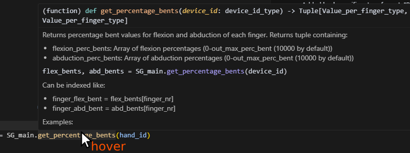
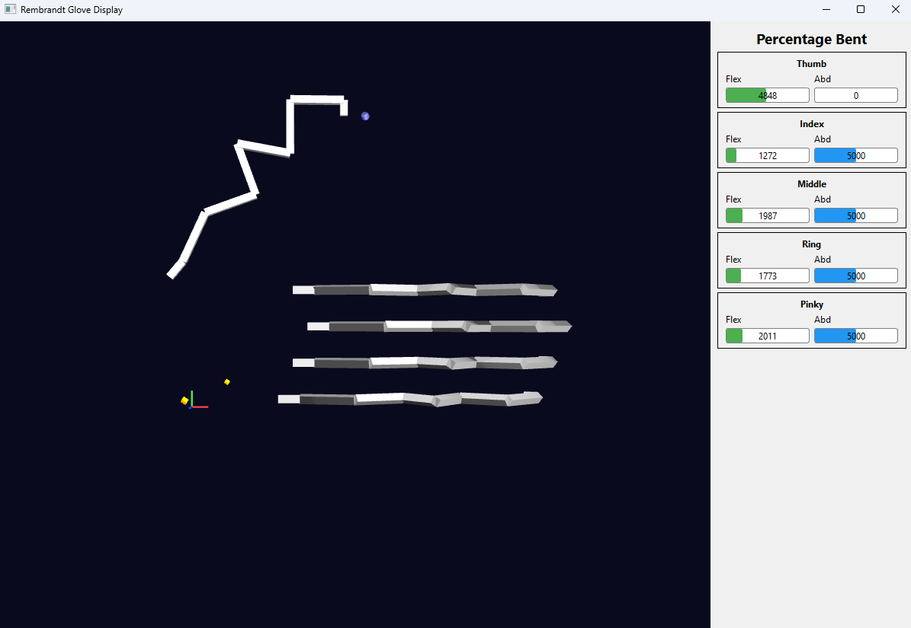
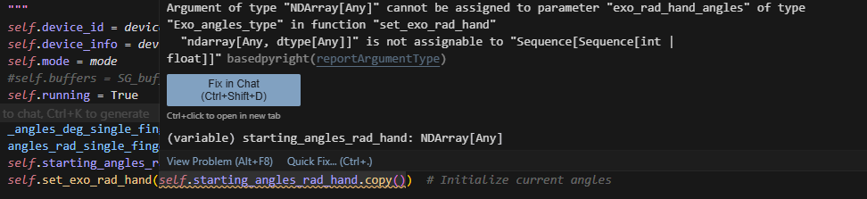

# What is this?
This [Git](https://github.com/Adjuvo/SenseGlove-R1-API) is the python API to interface with R1, an active force feedback glove with precise position tracking made for telerobotics by SenseGlove. With this API you can retrieve tracking data in many formats, and control the active force feedback pulling on the fingers in the glove. 

For other supported software see [Getting started](./getting_started.md)

> ⚠️ **In Development - Please give your feedback!**
>
> The product you received is a prototype!
> Both the product and the API are still under development and are subject to change. If you require certain functionality from the API, we would be happy to receive your feedback!

# Supported OS:
- Windows
- Linux Ubuntu >= 20.04, and other Linux systems with >= GCC 9 


# Supported python versions (currently)
If you don't have a python environment yet. We recommend installing python through [Anaconda](https://docs.conda.io/projects/conda/en/stable/user-guide/getting-started.html) to manage multiple versions/python environments.

- python 3.8
- python 3.11
- python 3.12

If you require a different version >3.8, we can support it by recompiling the library. Send us a message if required.


# Installation
## Required Software/drivers:

### Windows
For Windows, install the WinUSB driver: [Zadig](https://zadig.akeo.ie/). Linux does not require a driver.

   * Open this, with the glove plugged in.
   * Select R1 (Composite Parent) in the dropdown. Don't change any other settings. Click Install Driver.

### Linux
To allow non-root access to the Rembrandt device over USB, you need to add a custom udev rule. After cloning this repo, run:
```bash
./scripts/install_udev_rule.sh
```

### WSL
For Installation on Windows Subsystem for Linux (WSL), so you can run Linux within your Windows OS without dual boot, that's possible with minor caveats, see Troubleshooting.

# Setup

See [Troubleshooting](#troubleshooting) for common errors and issues.


1. Clone the repo:
   ```bash
   git clone https://github.com/Adjuvo/SenseGlove-R1-API
   cd SenseGlove-R1-API
   ```

    
2. `pip install`, see examples below. Make sure it uses the same **python environment** you are going to run it in!


    ```bash
    cd SenseGlove-R1-API     # Navigate to the parent directory of `SG_API` (where the setup.py file is).

    # Activate your (single) python environment if any!!! Example:
    conda activate yourenvironment # (see below for windows), or source /.venv/activate in linux envs for example

    pip install .
    ```

```bash
    # For windows conda,(doesn't let you run conda activate from anywhere)
        %USERPROFILE%/anaconda3/envs/yourEnvironment/python.exe -m pip install .
```
    


## Examples / Quick start
PLEASE READ THIS SECTION ENTIRELY BEFORE STARTING

This section walks you through the most important features of the script `main_example.py` which is a script using the main features of the API, as you would in your project. You can find this and more in the `examples` folder. 

#### Switch between Simulated and Real glove
For using an actual glove vs simulated glove (if you don't have one plugged in, want simple motion to debug, or no motion), change REAL_GLOVE_USB to SIMULATED_GLOVE:
```python
device_ids = SG_main.init(1, SG_T.Com_type.SIMULATED_GLOVE, SG_main.SG_sim.Simulation_Mode.FINGERS_OPEN_CLOSE)
#vs
device_ids = SG_main.init(1, SG_T.Com_type.REAL_GLOVE_USB, SG_main.SG_sim.Simulation_Mode.FINGERS_OPEN_CLOSE) #for real glove Simulation mode is ignored
```

#### On new data callback
The on_new_data callback fires when the glove has updated the data in the API, such as tracking or force data. `SG_main` contains all functions you need. Some commonly needed functions are given here.

```python
    def on_new_data(from_device_id):
        if from_device_id == hand_id:
            exo_poss, exo_rots = SG_main.get_exo_joints_poss_rots(hand_id)
            gui.update_hand_exo(exo_poss)

            fingertips_poss, fingertips_rots = SG_main.get_fingertips_pos_rot(hand_id)

            flexion_perc_bents, abduction_perc_bents = SG_main.get_percentage_bents(hand_id)

            forces = [5000, 5000, 5000, 5000] #sets all fingers to 500 mN
            SG_main.set_force_goals(hand_id, forces)

    SG_main.add_rembrandt_data_callback(on_new_data)


```

> ⚠️ **Important Note**
>
> Keep what is in the new_data callback as brief as possible (preferably just copying the data). Heavy calculations will drop the 1kHz framerate required for crisp haptic feedback. For more info see [Performance](fps-performance.md).


### Not using the callback 
You can call functions such as `SG_main.get_fingertips_pos_rot(hand_id)` or `SG_main.set_force_goals()` in your own while loop instead of the `on_new_data` callback. This will retrieve the latest tracking data available. When setting the forces, they will only be sent when the SG_API callback ends internally, sending the latest data in force goals to the glove. The callback `on_new_data` is purely a method to only update when new glove data is available.
 
### Keep the script running
The data callback will automatically update with new data at 1khz, but only if the file is still running.
To do this, call:
```python
    SG_main.keep_program_running()
    # after this will not execute. It blocks until stopping the program. 
    # Ctrl+C or a command closing python stops it.
```


### Not using keep program running
Alternatively, you can replace keep_program_running() with this to run your own while loop with:
```python
    try:
        while SG_main.SG_cb.running:
            time.sleep(0.01)  # This loop does not do anything but keep the program alive. Some sleep is important to not eat all CPU capacity.
    except: 
        pass # important errors will still log. This try/except just ignores the keyboard interrupt error on Ctrl+C.
```

> ⚠️ **Important Note**
>
> You must use sleep in the while loop, or your loop can eat up all CPU space which the callback needs to give data at 1kHz, important for good force feedback! For more info, see: [Performance](fps-performance.md).
 

 


### Hover to get Docs in code
`SG_main` will contain most of what you need.
Don't forget that you can always hover on a function to see how to use it (in Vscode at least), or check the [API Docs](index.md).
 


# Examples

## main_example.py
Running `examples/main_example.py` should give you a screen like this, showing the top view of the exoskeleton of the glove in real time (or simulated glove). The blue dots are the fingertip positions, and the linkages of the exoskeleton are white. The axes are drawn at the origin of the glove.

Press the right mouse button and drag to rotate.

 

Additionally, forces can be turned on that apply to all fingers in gradual sine waves, minimal force, to maximal force, and back to minimal repeatedly.

## record_glove.py and play_recording.py
Aside from simulation, you play back captured motions as if the glove were connected, and also record your own. Currently this only records and plays back the tracking, and not forces.

You can record from any script using the following:
```python
    print("Recording glove data for 10 seconds...")
    SG_recorder.record_glove_data(hand_id, 10.0, "myrecording.json")
```
You can find this file in the `recordings/` folder. Recording again will overwrite it.
You can play that recording back with:
```python
    print("Playing back recording...")
    SG_recorder.play_recording(hand_id, "myrecording.json")
```
This will simulate the glove with these motions, so actually output all data you would expect via the API. There are existing recordings to work with in the recordings folder.


### Convenience tip:
In .vscode / launch.json you can set "program": "${workspaceFolder}/your_file.py", and press F5 to play that script no matter the file you have open.

## Tracking and Control

The types of tracking data are explained in [Tracking](tracking.md). Force feedback is explained in [Control](./forces.md).


# Troubleshooting
## Libusb initialization error
```
Error: 2025-03-25 13:49:40.316 (   1.394s) [DataRetrievalLoo]    RembrandtDevice.cpp:1016  INFO| Initializing libusb device handle... - { VID: dead, PID: 1606, BN: 2, PN: 2, DA: 14 }
2025-03-25 13:49:40.316 (   1.394s) [DataRetrievalLoo]    RembrandtDevice.cpp:1024   ERR| Failed to initialize libusb device handle: Entity not found - { VID: dead, PID: 1606, BN: 2, PN: 2, DA: 14 }
```
This happens on Windows when you did not install the driver! See Required Software/Drivers above.

## FileNotFoundError .so or .dll:
```
FileNotFoundError: Could not find module 'C:\Users\<username>\anaconda3\envs\<yourenv>\lib\site-packages\SG_API\CPPlibs\libSG_math.dll' or `libSG_math.so` (or one of its dependencies). Try using the full path with constructor syntax.
```

This means that `pip install .` did not work correctly. Please try that again and make sure you use the correct python to call it. When in doubt, pip install using the python.exe similar to `C:/Users/yourUserName/anaconda3/envs/yourEnvironmentName/python.exe -m pip install -e .` (In some cases it may be pip3.) Then double check your interpreter in vscode to use the correct one (Ctrl+Shift+P -> Python interpreter). 

## FileNotFoundError: finger_joint_range_limits.csv not found
```
FileNotFoundError: Finger joint range limits CSV not found: /usr/local/lib/python3.12/dist-packages/SG_API/finger_joint_range_limits.csv
```
This was a packaging bug (not an environment/activation problem) in older versions of this repo: the CSV file was missing from the installed package data whenever installing with a plain, non-editable `pip install .`. It's fixed as of this package including `finger_joint_range_limits.csv` in `package-data`. If you still see this, update to the latest version of the repo, then reinstall (`pip install --force-reinstall .`, or `uv run` again which reinstalls automatically) so the CSV is picked up.

## Type errors
You might get yellow bars with errors similar to:



If your arrays have the correct shape, it should work when you actually run it. The warning is there because while numpy arrays can be used interchangeably with python arrays, the typing intellisense does not see they are compatible. You can ignore warnings like these as long as your array shape is correct.

Sequence[Sequence[int | float]] means it expects either a nested list or numpy array of shape: List[List[int or float]]. 

## running scripts is disabled on this system
```
anaconda3\shell\condabin\conda-hook.ps1 cannot be loaded because running scripts is disabled on this system.
```
This occurs sometimes on windows. To fix:
Open Powershell with admin rights (right click) and run:
`Set-ExecutionPolicy Unrestricted`

## Qt platform plugin errors (Linux)
If you encounter errors like:
```
qt.qpa.plugin: Could not load the Qt platform plugin "xcb" in "" even though it was found.
qt.qpa.plugin: From 6.5.0, xcb-cursor0 or libxcb-cursor0 is needed to load the Qt xcb platform plugin.
This application failed to start because no Qt platform plugin could be initialized.
```

This means Qt GUI dependencies are missing. To fix:

**Ubuntu/Debian:**
```bash
sudo apt-get update
sudo apt-get install libxcb-cursor0 libgl1-mesa-glx libgl1-mesa-dri
```

**Fedora/RHEL:**
```bash
sudo dnf install libxcb-cursor mesa-libGL mesa-libGLU
```

**Arch Linux:**
```bash
sudo pacman -S libxcb-cursor mesa
```

If you don't need the GUI, you can use the `no_GUI.py` example instead, or set the environment variable before running:
```bash
export QT_QPA_PLATFORM=offscreen
python examples/main_example.py
```

## Is my glove connected?
### Windows
Expected behavior in Windows Device Manager > Universal Serial Bus Devices: 
Once you plug in the device, you should see 2x Rembrandt showing up per glove (2 channels per glove).


If this is the case, the code should be able to connect. Make sure on Windows (not required for Linux), you also installed the driver with Zadig (see [Required Software/drivers](#required-softwaredrivers)).

## WSL only: USB forwarding
Only if you are using WSL (Windows Subsystem for Linux):
You'll get permission errors in libusb since it can't access the USB by default. To see the real glove moving in WSL:
```
usbipd list
``` 
see what number x-x is R1. Example: 6-2
```
usbipd bind --busid 6-2
usbipd attach --wsl --busid 6-2
```
During this time the glove won't be working anymore on Windows. To reattach to windows and disconnect it from WSL, call:
```
usbipd detach --busid 6-2
```


## WSL only: 3D visualization not showing

If the GUI opens and shows percentage bars, but the 3D glove model doesn't render:

**Symptoms:**
- GUI window opens successfully
- Percentage bent bars display correctly
- 3D glove visualization is blank/black
- May see errors like:
  - `QEGLPlatformContext: Failed to create context: 3009`
  - `Qt3D.Renderer.OpenGL.Backend: OpenGL context creation failed`
  - `Qt3D.Renderer.OpenGL.Backend: makeCurrent failed`Check:
```
glxinfo | grep -E "OpenGL renderer|OpenGL version" 
```
If this prints something like:
```
OpenGL renderer string: D3D12 (NVIDIA GeForce RTX 3050 Laptop GPU)
OpenGL version string: 3.1 Mesa 21.2.6
```

**Cause:** This is a **WSL-specific** graphics limitation. Qt3D's RHI backend requires OpenGL 3.3+, but WSL often only provides OpenGL 3.1 via hardware acceleration. **This issue does NOT occur on native Ubuntu/Linux** where proper graphics drivers provide OpenGL 3.3+.

**Solution - Use software rendering (WSL only):**

```bash
export LIBGL_ALWAYS_SOFTWARE=1
export QT_QPA_PLATFORM=xcb
python examples/main_example.py
```

**Note:** Software rendering is slower than hardware acceleration, and pixelated, but will display the 3D visualization correctly. This is a WSL limitation, not an issue with the API code.

**On native Ubuntu 20.04+:** Hardware-accelerated 3D visualization should work out of the box with proper graphics drivers installed. No workaround needed.
