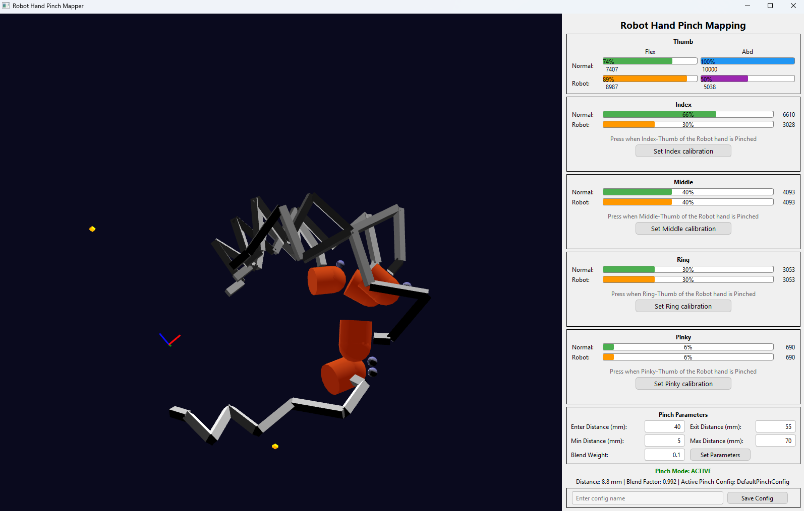

# Robot hand percentage bent mapper
`examples/Robot_hand_mapper_pbent.py` is an example where you can map percentage bents to accurate pinches on the robot hand when the glove pinches. 

 -  When not pinching it will use the default percentage bent values of the glove.
 -  When approaching a pinch, the percentage bent values from the glove (green) will be gradually mapped to the saved robot hand values when the glove detects pinching for a specific finger.

Create a config similar to the seed hand config with values the robot hand takes for each pinch. 

The robot_hand_mapper_pbent.py has a GUI that shows the updated mapping considering pinches as orange bars.

In the image you can see the index + thumb are pinching, and only that value (orange) is adjusted to map to a robot hand pinch.

The config must contain the values going out to the robot hand. You can use the button below each finger to save that current number to a config file, using also the Save config button at the bottom. Note that the **robot hand** (so not your glove)
 **should be making the pinches** when pressing the button. In the end, via GUI buttons or not, the saved config file must contain the inputs going into the robot hand that result in a robot hand pinch.
 
 After loading that config, the orange values retreived with `robot_flex, robot_abd = SG_main.get_rhm_percentage_bents(hand_id)` should give you accurate pinches.
 
 Currently we only provide this solution for 1DOF robot finger control via percentage bent.
 To learn how to adjust percentage bents and how they work, see [Tracking](tracking.md).
