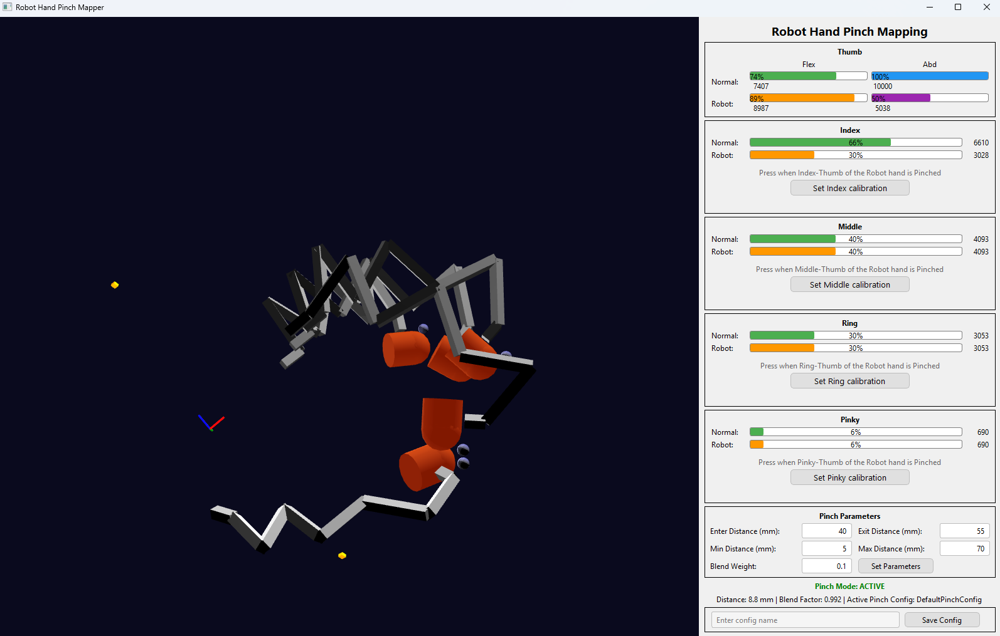

# Robot hand percentage bent mapper
The robot hand percentage bent (pbent) mapper internally takes the R1 pbent values, and also outputs pbent values. However, it adjusts them to make the robot hand pinch when the user pinches. To do that, there is a one time config calibration to note down the pbent values at which the robot hand pinches.

`examples/Robot_hand_mapper_pbent.py` is an example where you can map percentage bents to accurate pinches on the robot hand when the glove pinches. 

In this GUI, the green bars are the original R1 percentage bent values.
The orange bars are the output of the robot pbent algorithm.

 -  When not pinching it will use the default percentage bent values of the glove (green).
 -  When approaching a pinch, the percentage bent values from the glove (green) will be gradually mapped to the saved robot hand values when the glove detects pinching for a specific finger.

The robot_hand_mapper_pbent.py has a GUI that shows the updated mapping considering pinches as orange bars.

In the image you can see the index + thumb are pinching, and only that value (orange) is adjusted to map to a robot hand pinch.

# Calibrate your own robot hand

Create a config similar to the seed hand config with values the robot hand takes for each pinch.  The config file for this example can be found in `SG_API/configs/robot_hand_mapper/`. 

The config must contain the values going out to the robot hand. The easiest way to record the pbent values of the robot hand, is to use the glove to control the robot hand to go to a pinch, then note down the values. 

To make this easier, you can use the button below each finger to save that current number to a config file, using also the Save config button at the bottom. Note that the **robot hand** (so not your glove) **should be making the pinches** when pressing the button. In the end, via GUI buttons or not, the saved config file must contain the inputs going into the robot hand that result in a robot hand pinch.

After loading that config, the orange values retrieved with `robot_flex, robot_abd = SG_main.get_rhm_percentage_bents(hand_id)` should give the robot hand accurate pinches when the glove pinches.

Therefore at a pinch, the values in the orange bars should be equal to the percentage bent values filled in the config file.
 
Currently we only provide this solution for 1DOF robot finger control via percentage bent.
To learn how to adjust percentage bents and how they work, see [Tracking](tracking.md).

