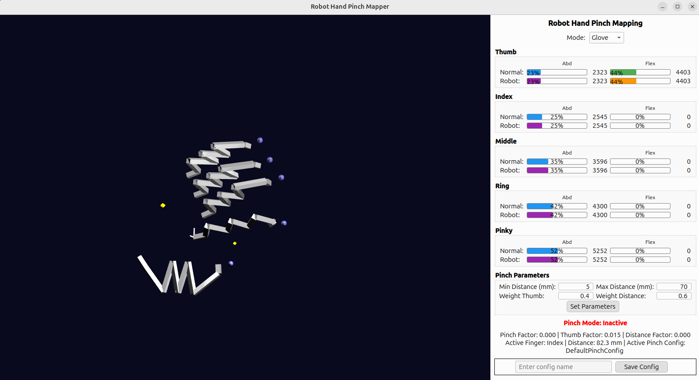
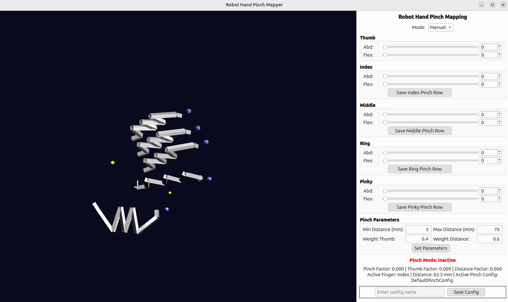

# Robot hand pinch mapper
In essence, it outputs the same `percentage_bent` 0 to 10000 glove flexions/abductions, but better: putting these values in the robot hand, the robot hand also pinches when the glove does.

The robot hand pinch mapper (`Robot_Pinch_Mapper`) takes the R1 percentage bent (pbent) values and fingertip distances, and outputs adjusted pbent values. It blends the glove's normal values towards a pre-calibrated "robot pinch target" as the user's glove approaches a pinch.


`examples/robot_pinch_mapper_example.py` is an example that maps percentage bents to accurate pinches on the robot hand when the glove pinches.

In this GUI, the green/blue bars are the original R1 percentage bent values ("Normal").
The orange/purple bars are the output of the pinch mapper ("Robot").

 - When not pinching, the mapper outputs the normal percentage bent values of the glove unchanged.
 - As the thumb abducts and a fingertip gets close to the thumb, the pinch influence ramps up smoothly and the output is blended towards the saved robot-hand pinch target for that finger.
 - Only the finger closest to the thumb is treated as the active pinch finger; the rest keep following the glove.

## Usage
See `robot_pinch_mapper_example.py`.
It can be imported seperately from SG_main, so you can import and it on the robot hand side.

```python
from SG_API.SG_robot_pinch_mapper import Robot_Pinch_Mapper

mapper = Robot_Pinch_Mapper(hand_id)

# per data-frame:
normal_flex, normal_abd = SG_main.get_percentage_bents(hand_id)
distances = SG_main.get_fingertip_distances(hand_id)

robot_flex, robot_abd = mapper.compute_rpm_bents(normal_flex, normal_abd, distances)
```

`robot_flex`/`robot_abd` are 5-length arrays (thumb, index, middle, ring, pinky) ready to send to the robot hand.

## GUI

`Robot_Pinch_GUI` (in `SG_API/SG_robot_pinch_gui.py`) visualizes the mapper live and has two modes, selectable from the dropdown at the top:

- **Glove**: 
    - Live Glove values against the Robot Blended values for Abduction and Flexion of the thumb and each finger.
    - Include the current pinch factor/thumb factor/distance factor debug info.

  

- **Manual**: 
    - Per-finger Abd/Flex sliders that drive the mapper's output directly (bypassing live glove data). 
    - Each finger has a **Save {Finger} Pinch Row** button that captures the thumb sliders + that finger's sliders straight into the mapper's `Robot_Pinch_Config.robot_pinch_targets` for that finger; no live glove required.

  

Both modes also expose **Pinch Parameters** (min/max pinch distance in mm, and the thumb/distance blend weights) that can be tuned live via **Set Parameters**.

# Calibrate your own robot hand

**Manual mode**: 
1. Switch the GUI to Manual
2. Drive the sliders until the robot hand (via your own control loop reading `mapper.get_manual_bents()`) makes the desired pinch.
3. Click **Save {Finger} Pinch Row** for that finger. 
4. Repeat for each finger.
5. Once you've captured targets for all four fingers, click **Save Config** at the bottom to write out a `Robot_Pinch_Config` Python file.

After loading/applying that config with `mapper.apply_config(config)`, the "Robot" values returned by `mapper.compute_rpm_bents(...)` should give the robot hand accurate pinches when the glove pinches.

Currently we only provide this solution for 1DOF robot finger control via percentage bent.
To learn how to adjust percentage bents and how they work, see [Tracking](tracking.md).
