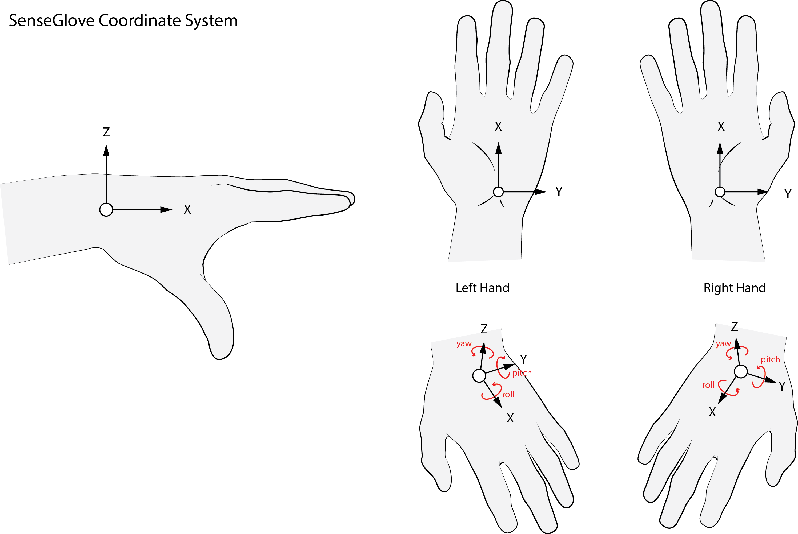
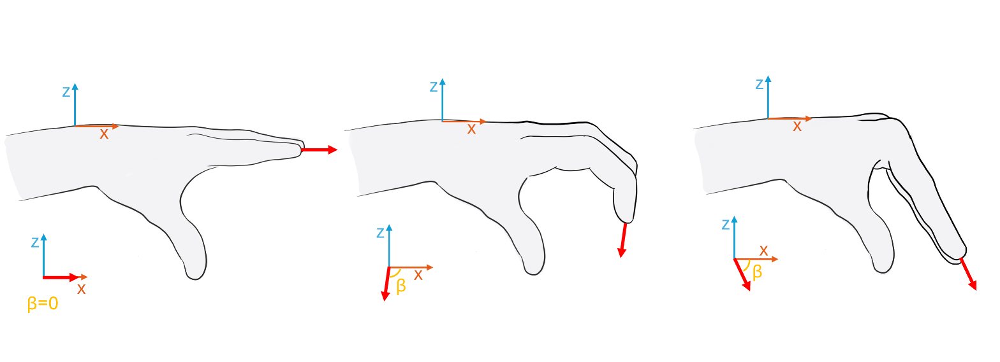
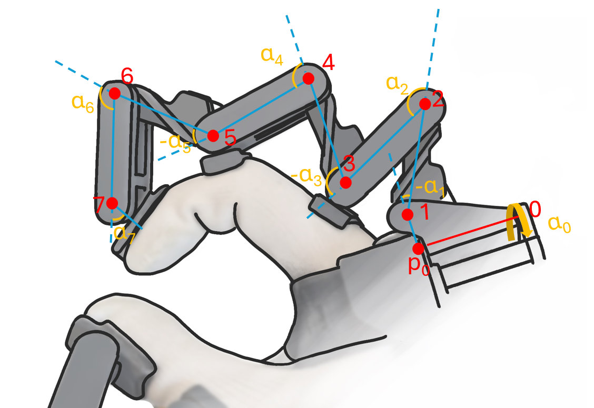

# Tracking
The API supports a few different representations of glove tracking data: 

- Fingertip positions / rotations
- Percentage bent of the fingers
- Raw exoskeleton data

## Coordinate system
We use the following coordinate system:
 
When the wrist rotation is 0, 0, 0, the following is true:

- The X-Axis runs parallel with the stretched fingers, running roughly from the wrist joint to the middle finger MCP joint.

- The Y-Axis runs along the MCP joints. For right hands, the positive direction is from pinky MCP to index finger MCP. For left hands, the positive direction is from index MCP to the index finger MCP.

- The Z-Axis points 'up' from the hand palm. The positive direction is from the palm of the hand to the back of the hand.

- Our left- and right hands share the same 'forward' and 'upward' directions. The difference in positive y-direction between left- and right hands means that finger flexion also shares the same positive / negative direction between the hands.

## Origin of the glove (0,0,0)
The 0.4 will have a dot just above the version number printed. For the 0.3 this is the same point but not visual on the prototype. In prototype 0.2, this has been a screw near the thumb base. 

## Fingertip positions, rotations
[get_fingertips_pos_rot()](api-reference.md#SG_API.SG_main.get_fingertips_pos_rot) gets the position (vec3) and rotation (quaternion) of each fingertip. The red point indicates this tip. 

 

This can be adjusted by changing FINGERTIP_OFFSET and FINGERTIP_OFFSET_ROT variable for the respective exoskeleton type within `SG_API.exo_dimensions`, which hold the offsets with respect to the final [exoskeleton position/rotation](#exo-positions-rotations). TODO: make this a user function.

## TODO: Fingertip distances

## Percentage bent

Percentage bent can be retrieved with the function [get_percentage_bents()](api-reference.md#SG_API.SG_main.get_percentage_bents). This returns `flexion_perc_bents` and `abduction_perc_bents`. Each is an array with as length of the number of fingers.

- **`flexion_perc_bents`**: 
    - All fingers: 0 (open) to 10000 (closed)

- **`abduction_perc_bents`**: 
    - **Thumb**: 
        - 0 → thumb is in plane with the palm
        - 10000 → thumb is not aligned with handpalm, but radially extended maximally
    - **Fingers**:
        - 0 → splay to the left
        - 10000 → splay to the right 
        - 5000 → in the middle

### How percentage bent is calculated
 The percentage bent calculations uses the orientations of the fingertips to determine how bent the fingers are. 
 

The orientations of these arrows are used. We calculate these by adding up the exoskeleton flexion angles for flexion percentage bent, and use the single abduction sensor for abduction percentage bent. This is then normalized between 0 and 10000 normalized based on a pre-set open and closed finger value. 
The left hand on the image would give 0, the middle around 7000 and the right one around 4000 in default settings. We use this algorithm because it is independent of different hand sizes.

### Adjusting the min/max bent settings:
***flex_angles*** and **abd_angles** can be obtained from `SG_main.get_raw_percentage_bent_angles()`.
These are the raw angles the percentage bent calculations are based on, and is β in the image.

The min/max ranges of these angles were determined experimentally. These can be changed by overwriting the default values with `SG_main.set_percentage_bent_vars()`. 

## TODO: Gripper open close
This function will map the movement of the index and thumb to a gripper open (0) and gripper closed (10000) value.

## Raw exoskeleton data

### Exo positions rotations
[get_exo_joints_poss_rots()](api-reference.md#SG_API.SG_main.get_exo_joints_poss_rots) returns the positions (vec3) and rotations (quaternion) of each joint in the exoskeleton with respect to the hub origin. These are indexible like `[finger_nr][exo_joint_nr]`.
The image shows the position locations, and the orientation when multiplying the quaternion with [1,0,0].

 

For flexion joints, the position is the center of each joint. For the first joint (splay), it is on the axis of the splay rotation, with the z of the first flexion joint. 

### Exo angles
[get_exo_angles_rad()](api-reference.md#SG_API.SG_main.get_exo_angles_rad) and [get_exo_angles_deg()](api-reference.md#SG_API.SG_main.get_exo_angles_deg) give the raw exoskeleton angles. These can be indexed with angles[`finger_nr`][`angle_nr`]. `angle_nr` 0 is the splay angle (around z), the rest are flexion angles.

The flexion angle definitions are:

- When an angle is set to 0, the linkages connected to that joint form a straight line.
- When the next link bends towards the handpalm, the angle is positive.
- When the next link bends away from the handpalm, the angle is negative.

The following image defines the angles in a common configuration.

 

